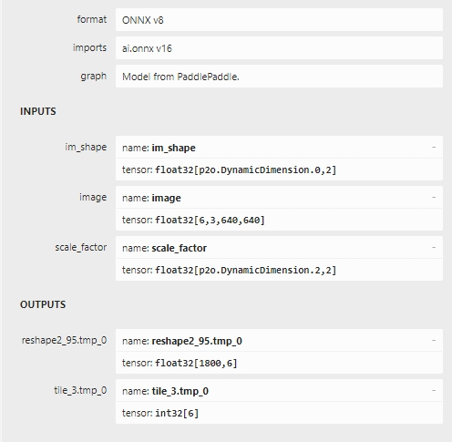
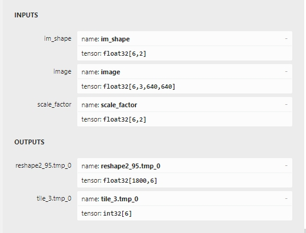
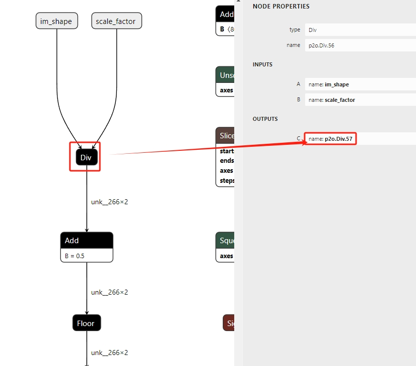
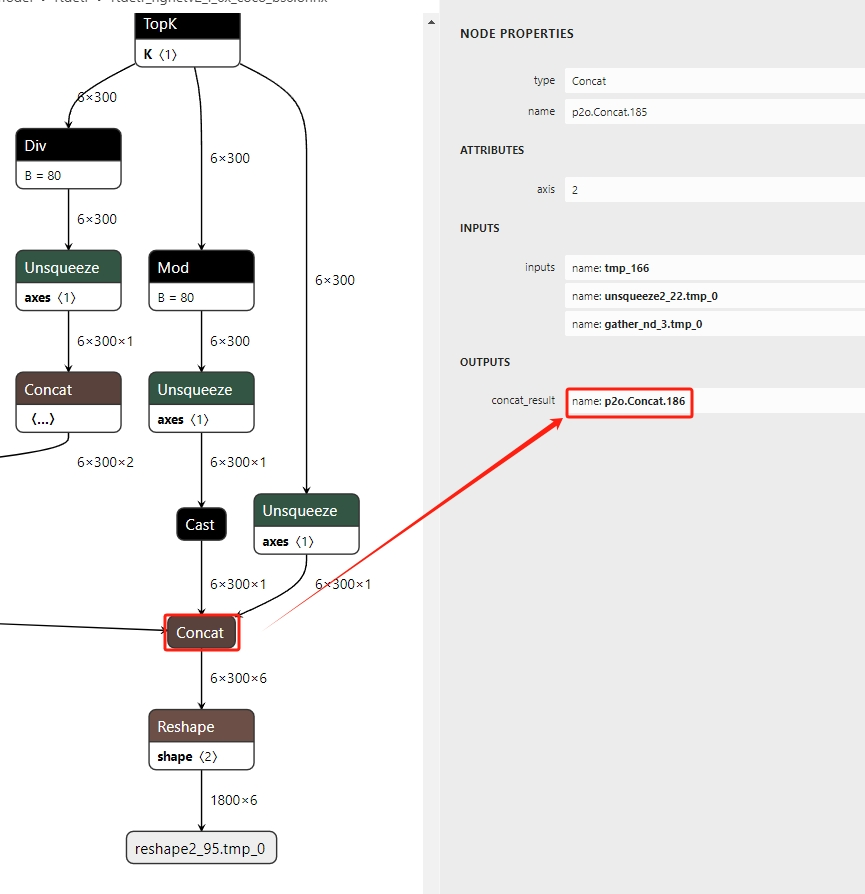
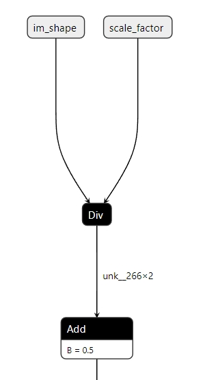
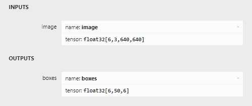
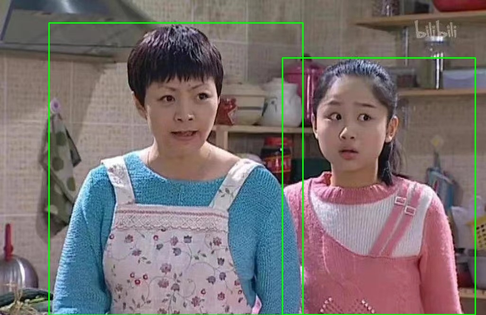

## RT-DETR ONNX模型手动后处理

**按照[rtdetr官方教程](https://github.com/PaddlePaddle/PaddleDetection/tree/release/2.7/configs/rtdetr)转换得到onnx模型**，其输入、输出如下图所示：



输入、输出具体含义见[PaddleDetection/deploy/EXPORT_MODEL.md](https://github.com/PaddlePaddle/PaddleDetection/tree/release/2.7/deploy/EXPORT_MODEL.md)

### Step1、动态batch转静态batch

```shell
./onnx_post_process_step1_dynamic_to_static rtdetr_hgnetv2_l_6x_coco.onnx 6
```
转换完后的ONNX模型输入、输出如下图所示：



### Step2、提取子模型
- 查看**Step1**得到的模型头部如下**Div**节点的的输出名，这里为**p2o.Div.57**(后面会用到)


- 查看**Step1**得到的模型头部如下**Concat**节点的的输出名，这里为**p2o.Concat.186**(后面会用到)


```shell
>>python extract_sub_onnx.py --help
usage: extract_sub_onnx.py [-h] --model MODEL --input_names INPUT_NAMES [INPUT_NAMES ...] --output_names OUTPUT_NAMES [OUTPUT_NAMES ...] --save_file SAVE_FILE

optional arguments:
  -h, --help            show this help message and exit
  --model MODEL         Path of directory saved the input model.
  --input_names INPUT_NAMES [INPUT_NAMES ...]
                        The input name(s) you want to extract.
  --output_names OUTPUT_NAMES [OUTPUT_NAMES ...]
                        The output name(s) you want to extract.
  --save_file SAVE_FILE
                        Path to save the new onnx model.

>>python extract_sub_onnx.py --model rtdetr_hgnetv2_l_6x_coco_bs6.onnx   --input_names 'image' 'p2o.Div.57' --output_names 'p2o.Concat.186' --save_file rtdetr_hgnetv2_l_6x_coco_bs6_sub.onnx
```

### Step3、将im_shape / scale_factor 再融入到模型中
经过**Step2**后，模型中少了**im_shape / scale_factor**操作，如下如图所示：



- 1、生成**im_shape / scale_factor**模型

```shell
>>python const_node.py --help                                          
usage: const_node.py [-h] --batch_size BATCH_SIZE [--ir_version IR_VERSION] [--opset_version OPSET_VERSION]

optional arguments:
  -h, --help            show this help message and exit
  --batch_size BATCH_SIZE
                        Model batch size
  --ir_version IR_VERSION
                        The ir version of onnx
  --opset_version OPSET_VERSION
                        The opset version of onnx
>>python const_node.py --batch_size 6 --ir_version 8 --opset_version 16
>>
```
执行完后生成**constant_img_shape_bs6.onnx**文件

```shell
>>python onnx_merge.py --help
usage: onnx_merge.py [-h] --onnx_path_1 ONNX_PATH_1 --onnx_path_1_output ONNX_PATH_1_OUTPUT --onnx_path_2 ONNX_PATH_2 --onnx_path_2_input ONNX_PATH_2_INPUT [--save_file SAVE_FILE]

optional arguments:
  -h, --help            show this help message and exit
  --onnx_path_1 ONNX_PATH_1
                        Path of input1 model.
  --onnx_path_1_output ONNX_PATH_1_OUTPUT
                        Output of input1 model.
  --onnx_path_2 ONNX_PATH_2
                        Path of input2 model.
  --onnx_path_2_input ONNX_PATH_2_INPUT
                        Input of input2 model.
  --save_file SAVE_FILE
                        Path to save the new onnx model.
                        
>>python onnx_merge.py --onnx_path_1 constant_img_shape_bs6.onnx --onnx_path_1_output 'output' --onnx_path_2 rtdetr_hgnetv2_l_6x_coco_bs6_sub.onnx --onnx_path_2_input 'p2o.Div.57' --save_file rtdetr_hgnetv2_l_6x_coco_bs6_sub_merge.onnx
```

### Step4(可选)

- 更改输入或者输出节点名字

```shell
>>python rename_onnx_model.py --help                                     
usage: rename_onnx_model.py [-h] --model MODEL --origin_names ORIGIN_NAMES [ORIGIN_NAMES ...] --new_names NEW_NAMES [NEW_NAMES ...] --save_file SAVE_FILE

optional arguments:
  -h, --help            show this help message and exit
  --model MODEL         Path of directory saved the input model.
  --origin_names ORIGIN_NAMES [ORIGIN_NAMES ...]
                        The original name you want to modify.
  --new_names NEW_NAMES [NEW_NAMES ...]
                        The new name you want change to, the number of new_names should be same with the number of origin_names
  --save_file SAVE_FILE
                        Path to save the new onnx model.

>>python rename_onnx_model.py --model rtdetr_hgnetv2_l_6x_coco_bs6_sub_merge.onnx --origin_names 'p2o.Concat.186'  --new_names 'boxes' --save_file rtdetr_hgnetv2_l_6x_coco_bs6_sub_merge.onnx
```

- 保留前N个检测结果
原始模型输出300个检测目标(class_id, score, x1, y1, x2, y2)并且已经按照score从高到低排好序，如果只想保留前N(<300)个目标，则可以通过以下步骤实现。

```shell

python topK_onnx.py --batch_size 6 --total_obj_num 300 --output_obj_num 50 --opset_version 16 --save_file post_topK.onnx

python onnx_merge.py --onnx_path_1 rtdetr_hgnetv2_l_6x_coco_bs6_sub_merge.onnx --onnx_path_1_output boxes --onnx_path_2 post_topK.onnx --onnx_path_2_input post_input --save_file rtdetr_hgnetv2_l_6x_coco_bs6_sub_merge_top50.onnx
```

最后得到的onnx模型输入、输出如下所示：



## 一步完成后处理
将上述**Step1—Step4**放在一起处理如下所示：

```shell
./onnx_post_process rtdetr_hgnetv2_l_6x_coco.onnx 6 'p2o.Div.57' 'p2o.Concat.186' 8  16 300 50
./onnx_post_process rtdetr_hgnetv2_l_6x_coco.onnx 1 'p2o.Div.57' 'p2o.Concat.186' 8  16 300 50
```

## Demo

以下是batch_size=1时的demo

原图：


```shell
python onnx_demo_bs1.py --onnx_path rtdetr_hgnetv2_l_6x_coco_bs1/rtdetr_hgnetv2_l_6x_coco_bs1_sub_merge_top50_final.onnx --inp_size 640 --img_path imgs/wx.jpg --det_thresh 0.7
```

检测结果：

